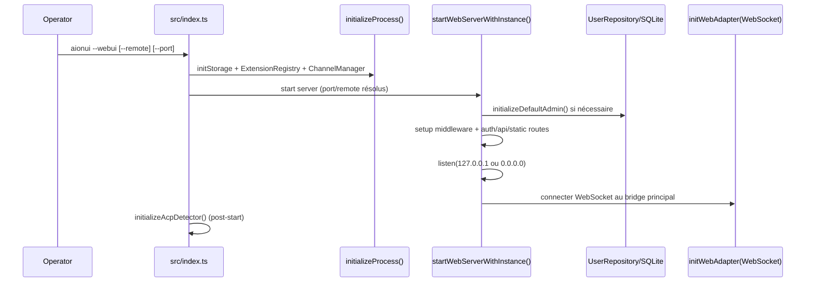
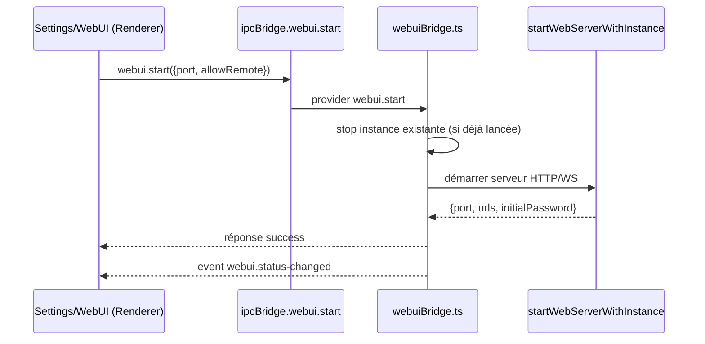
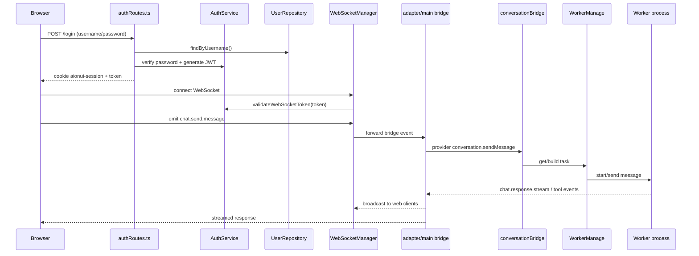

# CoWork Architecture (focus WebUI)

Ce document décrit l'architecture réellement implémentée dans la branche `main`, avec un focus sur le déploiement/exécution WebUI.

## 1. Vue d'ensemble

CoWork est une application Electron multi-processus avec deux modes d'exécution UI:

1. **Desktop**: fenêtre Electron (`BrowserWindow`) + bridge IPC.
2. **WebUI**: serveur HTTP/WS embarqué (Express + WebSocket), utilisable en local ou en distant.

Composants clés:

- **Main Process**: orchestration, bridge, services, DB, workers.
- **Renderer**: React/TypeScript (dans Electron et dans navigateur WebUI).
- **Web Server**: auth, API, routes statiques, WebSocket bridge.
- **Workers**: processus utilitaires Electron (`utilityProcess.fork`) pour exécuter les agents IA.
- **Storage**: SQLite (`aionui.db`) + fichiers config (`userData/config`).

## 2. Topologie logique

```mermaid
flowchart LR
  subgraph Client[Clients]
    E[Electron Renderer]
    B[Browser WebUI]
  end

  subgraph Main[Electron Main Process]
    P[Preload + IPC]
    BA[Bridge Adapter]
    BR[Process Bridges\nconversation/webui/cron/...]
    WS[WebSocket Manager]
    SVC[Services\nAuth/Webui/Cron/...]
    DB[(SQLite)]
    WK[Worker Managers]
    WP[Worker Processes\n(gemini/acp/codex/...)]
  end

  subgraph Web[Embedded Web Server]
    EX[Express Routes]
    ST[Static/Vite Proxy]
    AU[Auth + Middleware]
  end

  E -->|electronAPI.emit/on| P --> BA
  B -->|HTTP /login /api/*| EX
  B -->|WebSocket bridge events| WS --> BA

  BA --> BR --> SVC --> DB
  BR --> WK --> WP

  EX --> AU --> BR
  EX --> ST

  BA -->|broadcast events| E
  BA -->|broadcast events| WS
```

## 3. Flux de démarrage WebUI (déploiement)

### 3.1 Mode WebUI headless (`--webui`)



### 3.2 Activation WebUI depuis l'app Desktop



## 4. Flux runtime WebUI (auth + chat)



## 5. Résolution de config au déploiement WebUI

Port (ordre de priorité):

1. `--port` ou `--webui-port`
2. `AIONUI_PORT` ou `PORT`
3. `webui.config.json` (userData)
4. défaut `25808`

Remote access (`allowRemote=true`) si au moins un de ces points est vrai:

1. flag `--remote`
2. `AIONUI_ALLOW_REMOTE=true` ou `AIONUI_REMOTE=true`
3. `AIONUI_HOST` dans `{0.0.0.0, ::, ::0}`
4. `webui.config.json.allowRemote=true`

Binding réseau:

- local only: `127.0.0.1`
- remote: `0.0.0.0`

## 6. Sécurité et isolation

- Auth JWT + cookie (`aionui-session`), invalidation globale via rotation de secret.
- WebSocket refuse les tokens invalides/expirés et coupe la session (`1008`).
- Tokens en query string explicitement évités (HTTP + WS).
- CORS dynamique basé sur `localhost`, IPs réseau, et env vars.
- Rate limiting sur login/API.
- QR login token one-shot, expirant (5 min), avec restriction local-only quand le serveur n'est pas en mode remote.
- Contributions WebUI d'extensions validées (namespace obligatoire, path traversal bloqué).

## 7. Notes opérationnelles pour déploiement WebUI

- En **dev** (`bun run webui`), si le build renderer n'existe pas, le serveur WebUI proxy vers Vite (`localhost:5173`).
- En **packagé/prod**, WebUI sert les assets compilés depuis `out/renderer`.
- Sur Linux headless, prévoir un display virtuel (ex: Xvfb), car le runtime reste Electron.

## 8. Références code

- `src/index.ts`
- `src/process/index.ts`
- `src/process/initBridge.ts`
- `src/process/bridge/index.ts`
- `src/process/bridge/webuiBridge.ts`
- `src/process/bridge/services/WebuiService.ts`
- `src/webserver/index.ts`
- `src/webserver/setup.ts`
- `src/webserver/routes/authRoutes.ts`
- `src/webserver/routes/apiRoutes.ts`
- `src/webserver/routes/staticRoutes.ts`
- `src/webserver/websocket/WebSocketManager.ts`
- `src/adapter/main.ts`
- `src/adapter/browser.ts`
- `src/common/ipcBridge.ts`
- `src/process/WorkerManage.ts`
